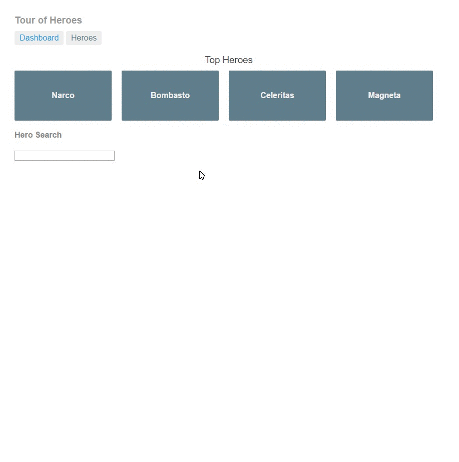

# Angular 2 - Tour of Heroes

Application made following the [Tour of Heroes tutorial](https://angular.io/docs/ts/latest/tutorial/) from the official website.

## How to install
- Make sure you have [Node.js and npm installed](https://nodejs.org/en/download/current/).
- Clone this repo in some directory: `git clone https://github.com/kevinalh/angular-tour-of-heroes.git`. Fork and clone if you want to make changes.
- In the same directory as before, run `npm install`. Some warnings might appear. That's fine as long as there are no `npm ERR!` messages at the end of the installation, as the [Quickstart page](https://angular.io/docs/ts/latest/quickstart.html) says.
- `npm start` and the website should appear on a browser.

## A note about versions
Given that the Angular project is changing very quickly, so is the documentation. This project was finished on August 2016, using Angular RC5, so take that into account when using this in the future.
